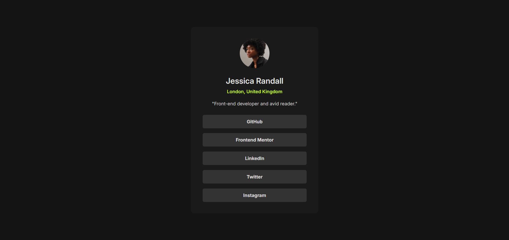

# Frontend Mentor - Social links profile solution

This is a solution to the [Social links profile challenge on Frontend Mentor](https://www.frontendmentor.io/challenges/social-links-profile-UG32l9m6dQ). Frontend Mentor challenges help you improve your coding skills by building realistic projects. 

## Table of contents

- [Overview](#overview)
  - [The challenge](#the-challenge)
  - [Screenshot](#screenshot)
  - [Links](#links)
- [My process](#my-process)
  - [Built with](#built-with)
  - [What I learned](#what-i-learned)
- [Author](#author)

## Overview

### The challenge

Users should be able to:

- See hover and focus states for all interactive elements on the page

### Screenshot

### Links

- Solution URL: [https://www.frontendmentor.io/solutions/responsive-social-links-profile-card-Mkoq_EM_Xt](https://www.frontendmentor.io/solutions/responsive-social-links-profile-card-Mkoq_EM_Xt)
- Live Site URL: [https://robiulsagor.github.io/social-links-profile](https://robiulsagor.github.io/social-links-profile/)

## My process

### Built with

- Semantic HTML5 markup
- CSS custom properties
- Flexbox
- Mobile-first workflow

### What I learned

This was pretty easy for me. 

## Author

- Website - [Robiul Islam Sagar](https://robiulportfolio.vercel.app/)
- Frontend Mentor - [@robiulsagor](https://www.frontendmentor.io/profile/robiulsagor)
- LinkedIn - [@robiul](https://www.linkedin.com/in/robiul-islam-sagar-356582226/)